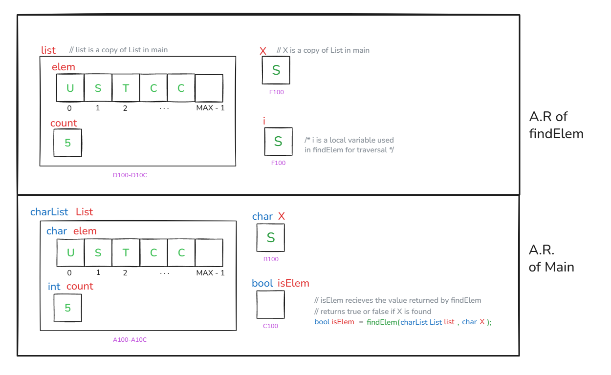
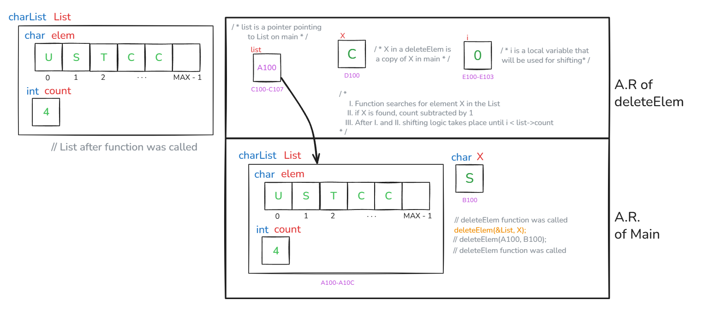
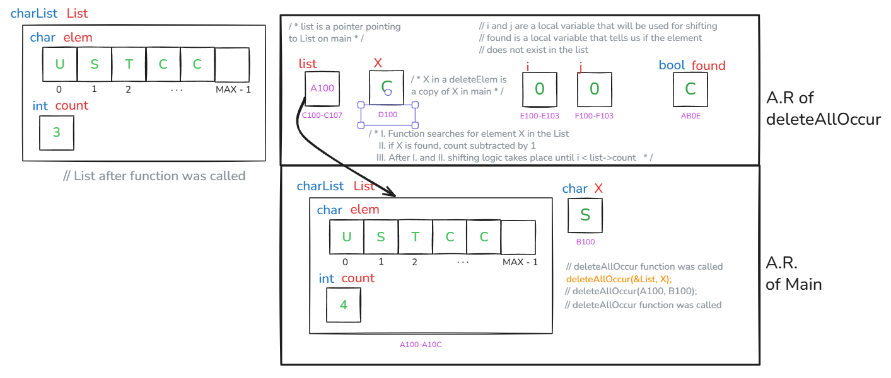

# Execution Stack Drawing

This document shows the execution stack representations for the functions `findElem`, `deleteElem`, and `deleteAllOccur`.  
Diagrams should be placed below each description.

---

## 1. findElem

**Description:**  
Execution stack contains the parameter `list`, the element `X`, and loop index `i`. The loop scans until either `X` is found or the end is reached. Returns `true` if found, otherwise `false`.

<p align="center">
  
</p>

``` C
bool findElem(charList list, char X){
    int i;
    for(i = 0; i < list.count && list.elem[i] != X; i++){}
    // B - 5
    return(i < list.count)? true : false;
}
```

---

## 2. deleteElem

**Description:**  
Execution stack holds the pointer to `list`, the element `X`, and loop index `i`. If list is not empty and `X` is found, all elements after `X` are shifted left and `count` is reduced. If not found, prints a message.

<p align="center">
  
</p>

``` C
void deleteELem(charList *list, char X){
    if(list->count != 0){ // Checks if List is not Empty
        int i;
        // Search for the element x in the list
        for(i = 0; i < list->count && list->elem[i] != X; i++){}

        // If found, shift all elements after it one step left
        // C - a
        if(i < list->count){
            list->count--; // reduce list size
            
            //shifting logic
            for(; i < list->count; i++){
                list->elem[i] = list->elem[i + 1];
            }
        }else{
            printf("element does not exist!"); // C - b
        }
    }else{
        printf("List is empty"); // C - c
    }
}
```
---

## 3. deleteAllOccur

**Description:**  
Execution stack includes the pointer to `list`, the element `X`, a `found` flag, and loop counters `i` and `j`. Every occurrence of `X` is deleted by shifting elements left. If no occurrence is found, a message is printed.

<p align="center">
  
</p>

``` C
// Version 1
void deleteAllOccur(charList *list, char X){
    // VERSION 1 //
    if(list->count != 0){ // Checks if List is not Empty
        bool found = false;

        for(int i = 0; i < list->count;){
            // D - a
            if(list->elem[i] == X){
                // marks that X is found inside the List
                found = true;
                // Shift elements left to overwrite the found element
                for(int j = i; j < list->count - 1; j++){
                    list->elem[j] = list->elem[j + 1];
                }
                list->count--; // reduce list size
            }else{
                i++;
            }
        }
        if(found == false){
            printf("Element '%c' does not exist in the list!\n", X); // D - b
        }
    }else{
        printf("List is empty"); // D - c
    }
}

// Version 2
void deleteAllOccur(charList *list, char X){
    if(list->count != 0){ // Check if the list is not empty
        int i, j;
        bool found = false; // Flag to track if X is found at least once
        // Traverse the list
        // i = read index (scans through all elements)
        // j = write index (builds the new list without X)
        for(i = j = 0; i < list->count; i++){
            if(list->elem[i] != X){
                // If current element is not X, keep it at the write position
                list->elem[j] = list->elem[i];
                j++; // move write index forward
            }else{
                // If current element is X, skip it
                found = true; // mark that we found at least one X
            }
        }
        // Update the number of elements after deletion
        list->count = j;

        // If X was never found in the list, print a message
        if(!found){
            printf("Element '%c' does not exist in the list!\n", X); // D - b
        }
    }else{
        // If the list is empty, print a message
        printf("List is empty"); // D - c
    }
}
```

---

