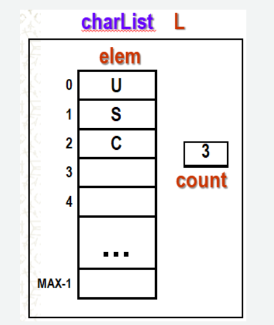

# Exercise\_01\_Array\_Representation

## Overview

This exercise explores array representation, user-defined data types, and function implementations in C. You will define a custom array type, write and test functions that perform search and deletion operations, and visualize execution using a call stack illustration.

---

## Illustration of Array Representation

  

**Notation:**

* If there are **two names**, the first represents a **data type** and the second represents a **variable name**.
* If there is **only one name**, it represents a **variable name**, and you must determine its data type based on the illustration.

---

## Activities

### A) Define Data Type and Macro

1. Write an appropriate definition of **datatype `charList`**.
2. Define **`MAX`** as a macro name for the maximum size of the array.

---

### B) Function: `findElem()`

**Specification:**

* Given a list and an element `X`, function `findElem()` will return **true** if element `X` is in the list; otherwise, return **false**.
* Uses `stdbool.h` for the `bool` data type (`true` and `false`).

**Constraints:**

* Only **1 return statement**
* No **break** or **continue** statements

**Tasks:**

1. Write an appropriate **function header** for `findElem()`.
2. Write an appropriate **function call**. Declare and initialize variables as needed before the call (no garbage values).
3. Draw the **execution stack (call stack)** representing the function call. Each variable should be shown with its name, value, and address (use arbitrary addresses such as `A100`, `B100`, etc.).
4. Write the **code** of the function `findElem()`.
5. **Simulate** the function with the following test cases:

   * a) List is empty
   * b) List is not empty and element `X` is in the list
   * c) List is not empty and element `X` is not in the list

---

### C) Function: `deleteElem()`

**Specification:**

* Given a list and an element `X`, function `deleteElem()` will remove the **first occurrence** of element `X` from the list.

**Constraints:**

* No **break** or **continue** statements

**Tasks:** Perform the same **5 steps as in Part B**.

**Modified Test Cases:**

1. List is not empty and element `X` is at the:

   * i) first position
   * ii) last position
   * iii) middle position
2. List is not empty and element `X` is **not in the list**
3. List is empty

---

### D) Function: `deleteAllOccur()`

**Specification:**

* Given a list and an element `X`, function `deleteAllOccur()` will remove **all occurrences** of element `X` from the list.

**Constraints:**

* No **break** or **continue** statements

**Tasks:**

1. Perform **steps 1–4 in Part B**
2. Use the **test cases from Part C**

---

## Notes

* Use proper memory management practices when shifting elements during deletion.
* Ensure that test cases cover **edge cases** (empty list, element not found, element at boundary positions).
* Document your code with comments for clarity.

---
