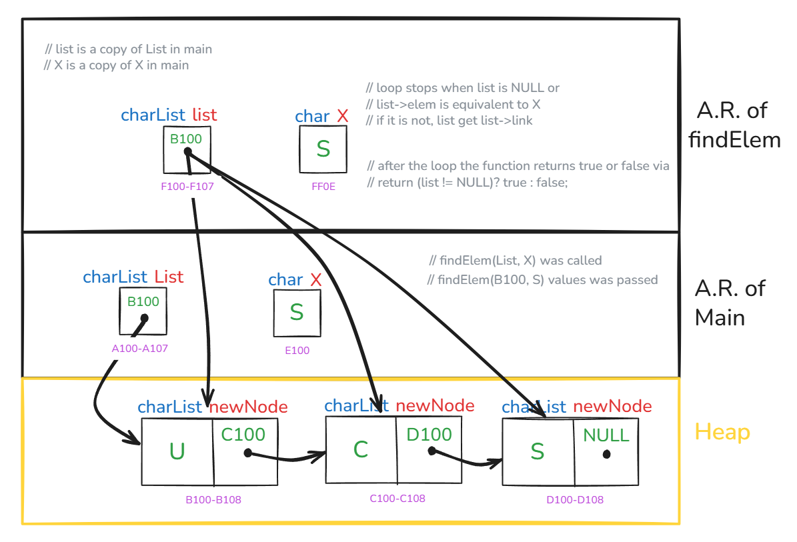
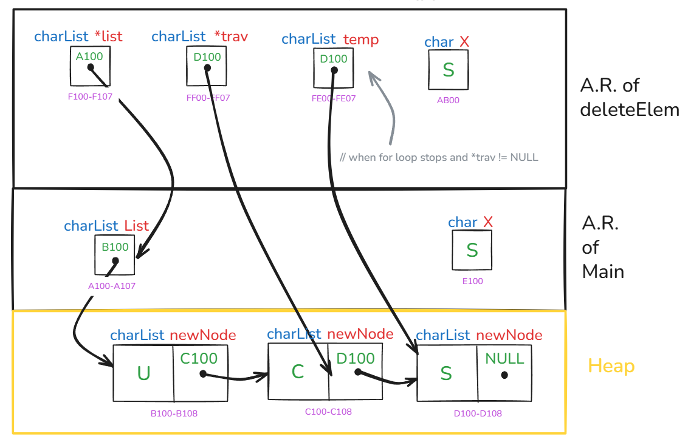
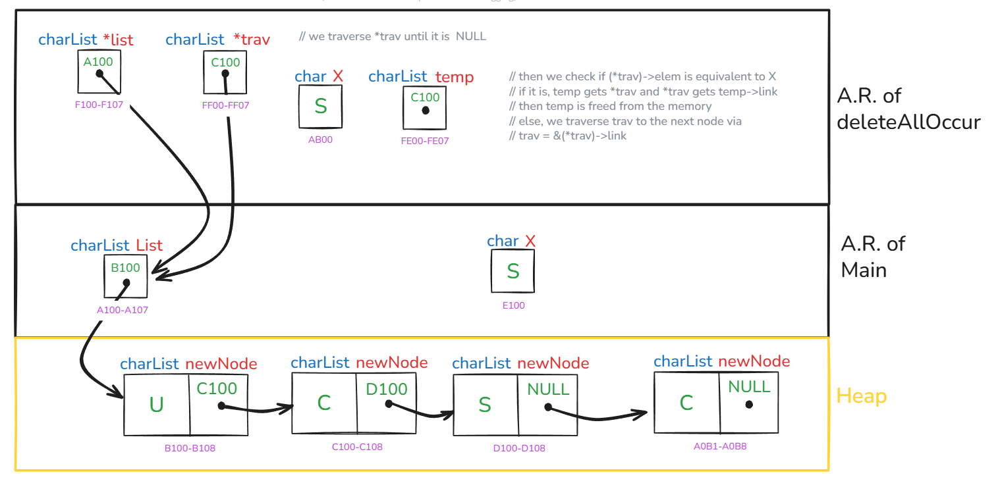

# Execution Stack Drawing

This document shows the execution stack representations for the functions `findElem`, `deleteElem`, and `deleteAllOccur`.  
Diagrams should be placed below each description.

---

## 1. findElem

**Description:**  
Execution stack contains the parameter `list` (pointer to the head of the linked list) and the element `X`. The function traverses the list node by node until either X is found or the end of the list is reached. Returns `true` if found, otherwise `false`.

<p align="center">
  
</p>

``` C
bool findElem(charList list, char X){
    if(list != NULL){
        for(; list != NULL && list->elem != X; list = list->link){}
    }else{
        printf("List is empty");
    }
    // return true if found, false if not
    return(list != NULL)? true: false;
}
```
---

## 2. deleteElem

**Description:**  
Execution stack contains a pointer to the head of the linked list `list` and the element `X`. The function searches for the `first node` containing X. If found, the node is unlinked from the list and its memory is freed. If X is not found, a message is printed.

<p align="center">
  
</p>

``` C
void deleteElem(charList *list, char X){
    if(*list != NULL){
        charList *trav;
        // traverse until we find X or reach end
        for(trav = list; *trav != NULL && (*trav)->elem != X; trav = &(*trav)->link){}
        if(*trav != NULL){
            charList temp = *trav;      // store node to delete
            *trav = (*trav)->link;      // unlink node from list
            free(temp);                 // free memory
        }else{
            printf("Element '%c' does not exist\n", X);
        }
    }else{
        printf("Nothing to delete, list is empty\n");
    }
}
```
---

## 3. deleteAllOccur

**Description:**  
Execution stack contains a pointer to the head of the linked list `list` and the element `X`. The function traverses the list and `deletes all` nodes containing X by unlinking them and freeing their memory. If no occurrence of X is found, a message is printed.

<p align="center">
  
</p>

``` C
void deleteAllOccur(charList *list, char X){
    if(*list != NULL){
        charList *trav;
        // traverse list
        for(trav = list; *trav != NULL;){
            if((*trav)->elem == X){
                // found a match, unlink and delete
                charList temp = *trav;
                *trav = temp->link;
                free(temp);
            }else{
                // move to next node
                trav = &(*trav)->link;
            }
        }
    }else{
        printf("Nothing to delete, list is empty\n");
    }
}
```

---

