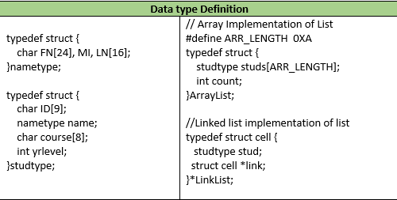

# Exercise 03: Array and Linked List

## Overview
This exercise focuses on implementing **Array-based** and **Linked List-based** data structures in C.  
You are required to write insertion and deletion operations for both implementations using the provided data type definitions.

---

## Data Type Definitions

<p align="center">
  
</p>

``` c
typedef struct {
    char FN[24];
    char LN[16];
    char MI;
}nametype;

typedef struct{
    char ID[9];
    nametype name;
    char course[10];
    int yrlevel;
}studtype;

typedef struct{
    studtype studs[ARR_LENGHT];
    int count;
}ArrayList;

typedef struct cell{
    studtype stud;
    struct cell *link;
}*LinkList;

```

# Insert and Delete Operations

For each of the implementations (**Array** and **Linked List**), write the code for the following insert and delete operations.

---

## **Constraints**
- Only **one (1) return statement** is allowed if the function’s return type is not `void`.  
- **No `break` or `exit` statements** are allowed.  

---

## **Operations**

### 1. `insertFirst()`
The function will insert the given element at the **first position** of the given list.

---

### 2. `insertLast()`
The function will insert the given element at the **last position** of the given list.

---

### 3. `insertLastUnique()`
The function will insert the given element at the **last position** of the given list **if the element does not yet exist**.  
- Elements are uniquely identified through the **ID**.

---

### 4. `insertAtPosition()`
The function will insert a given element at the **valid position** in the given list.  
- Note: The position is integral and may not always be valid.

---

### 5. `deleteElem()`
The function will delete the element with the given **ID** in the list.  
- The deleted element will be **returned** to the calling function.  
- If no element is deleted, return a **dummy variable** containing:
  - `"XXXXX"` for strings  
  - `'X'` for characters  
  - `0` for integers  

---

### 6. `separateCourse()`
The function will remove from the given list all elements bearing the specified **course** and put them in a **new list**, which will be returned to the calling function.
