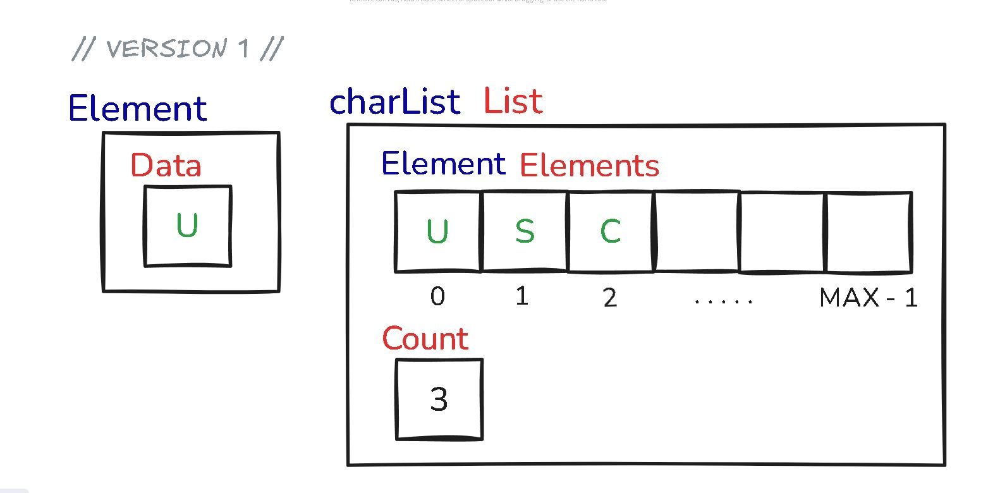
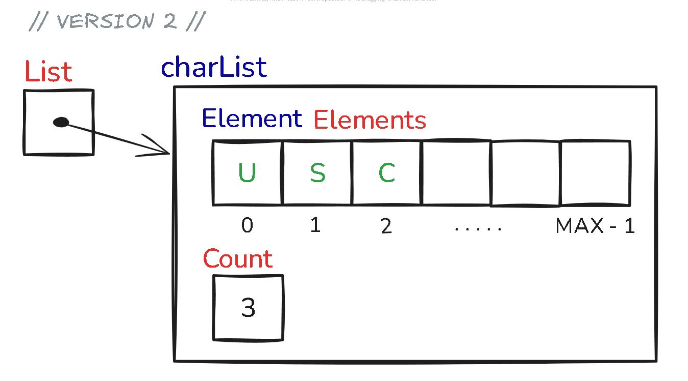
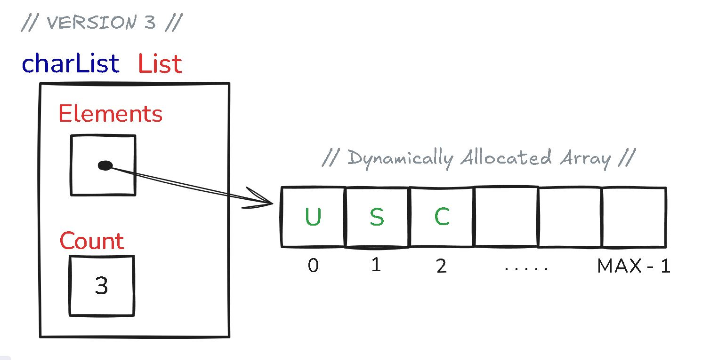
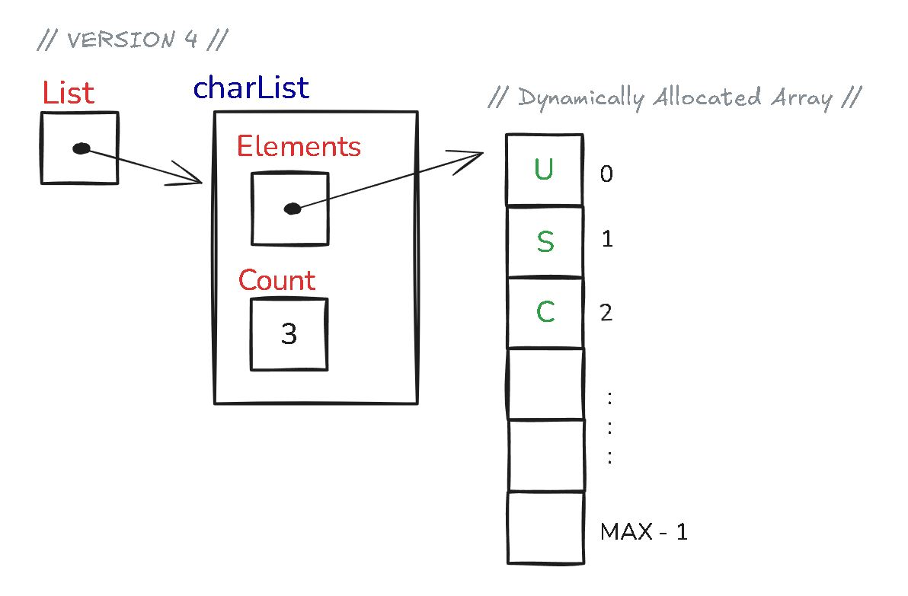

# List Array Implementation

This document explains four variations of implementing a list using arrays in C.  
Each version differs in whether the **List** is a structure, a pointer to a structure, or whether it stores a **static array** or a **dynamic array**.

---

## **Version One**  
**Definition:**  
`List` is a **structure** containing:  
- A **fixed-size array** of `Element`  
- An integer `count` to track the number of elements.

```c
typedef struct {
    char data;
} Element;

typedef struct {
    Element Elements[MAX];
    int count;
} charList;

charList List;
```
<p align="center"></p>

**Key points:**
- Array size is fixed at compile time.
- Structure directly holds the array in memory.
- Simple, fast access.
- No dynamic memory management required.

---

## **Version Two**  
**Definition:**  
`List` is a **pointer to a structure** containing:  
- A **fixed-size array** of `Element`  
- An integer `count`.

```c
typedef struct {
    char data;
} Element;

typedef struct node {
    Element Elements[MAX];
    int count;
} charList;

charList *List;
```
<p align="center"></p>

**Key points:**
- Similar to Version One, but accessed via a pointer.
- Useful if you want to pass references to functions without copying the structure.
- Still uses fixed-size array.

---

## **Version Three**  
**Definition:**  
`List` is a **structure** containing:  
- A **pointer** to the first element of a **dynamic array**  
- An integer `count`.

```c
typedef struct {
    char data;
} Element;

typedef struct {
    Element *Elements; // dynamically allocated
    int count;
} charList;

charList List;
```
<p align="center"></p>

**Key points:**
- Allows resizing the array at runtime using `malloc` / `realloc`.
- Memory management is required (allocate, free).
- More flexible than fixed-size arrays.

---

## **Version Four**  
**Definition:**  
`List` is a **pointer to a structure** containing:  
- A **pointer** to the first element of a **dynamic array**  
- An integer `count`.

```c
typedef struct {
    char data;
} Element;

typedef struct node {
    Element *Elements; // dynamically allocated
    int count;
} charList;

charList *List;
```
<p align="center"></p>

**Key points:**
- Combines pointer-to-struct access with a dynamic array.
- Most flexible form.
- Good for passing around without copying data.
- Requires careful memory management.

---

## **Comparison Table**

| Version | Struct or Pointer to Struct | Static or Dynamic Array | Memory Management Needed | Flexibility |
|---------|-----------------------------|--------------------------|--------------------------|-------------|
| One     | Struct                      | Static                   | No                       | Low         |
| Two     | Pointer to Struct           | Static                   | No                       | Low         |
| Three   | Struct                      | Dynamic                  | Yes                      | High        |
| Four    | Pointer to Struct           | Dynamic                  | Yes                      | High        |

---

## **Choosing a Version**
- **Use Version One** when you want simplicity and know the maximum size in advance.  
- **Use Version Two** if you want pointer semantics but don’t need resizing.  
- **Use Version Three** for flexible lists that can grow or shrink dynamically.  
- **Use Version Four** for maximum flexibility and efficient passing between functions.
