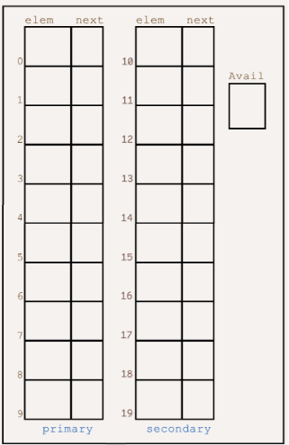

# ✈️ Airport Code Lookup — Closed Hashing Dictionary (Cursor-Based with Progressive Overflow)

## 🧩 Overview
This project simulates a **Closed Hashing Dictionary** using the **Cursor-Based Implementation** and **Progressive Overflow** method.  
It demonstrates how airport codes (e.g., `JFK`, `LAX`, `SFO`) are stored and managed in a virtual heap structure, using a **hash function** to determine their index and handle collisions via overflow chaining.

---

## 🎯 Objective
Simulate a hash-based dictionary system that:
1. Stores 3-character airport codes using **cursor-based closed hashing**.
2. Resolves collisions using the **progressive overflow** technique.
3. Outputs:
   - The **final state of the virtual heap**.
   - The **hash index** for each code in the set.

---

## 🧮 Given Data

### **Set A**
``` c
{"JFK", "LAX", "SFO", "CDG", "LHR", "NRT", "ATL", "DXB", "PEK", "MIA", "SYD", "ORD"}
```

### **Hash Function**
``` c
hash(code) = ((code[0] - 'A') * 26 * 26 + (code[1] - 'A') * 26 + (code[2] - 'A')) % 10
```

### **Image**

<p align="center"></p>

#### Example
hash("JFK") → 4


---

## 🧱 Virtual Heap Structure

| Index | elem | next |   | Index | elem | next |
|:-----:|:-----:|:-----:|---|:-----:|:-----:|:-----:|
| 0–9   | Primary slots | Used for direct hash placements |
| 10–19 | Secondary slots | Used for overflow storage |

**Avail**: Points to the first available node in the overflow area.

---

## 🔁 Process Summary
1. Compute hash index for each airport code.
2. If the slot is empty → place the code directly.
3. If the slot is occupied → use **progressive overflow**:
   - Locate the next available index in the secondary list.
   - Link it using the `next` pointer from the primary node.
4. Continue until all codes are inserted.

---

## 📄 Final Output Requirements
Your final output document must include:
1. ✅ **Final state of the virtual heap** — showing each slot’s `elem` and `next`.
2. 🧠 **Hash index for each code** — indicating where each airport code was placed.

---

## 📘 Example Output Format

### **Hash Index Table**
| Code | Hash Index |
|:-----|:------------:|
| JFK  | 4 |
| LAX  | 7 |
| ...  | ... |

### **Final Virtual Heap**
| Index | elem | next |
|:------|:-----|:-----:|
| 0 | ... | ... |
| 1 | ... | ... |
| ... | ... | ... |
| 19 | ... | ... |

---

## 🧠 Notes
- The **primary list (0–9)** does not use `avail`.
- The **overflow list (10–19)** requires proper `avail` tracking.
- Cursor-based structures are often implemented using arrays instead of pointer-based linked lists.

---

## 👨‍💻 Author
**John Lorenz Codilla**  
Data Structures and Algorithms (DSA) Project — *Closed Hashing Dictionary Simulation*

---

## 🧾 References
- *Data Structures and Algorithms in C* — by Reema Thareja  
- Lecture Notes on **Cursor-Based Lists and Hashing**
